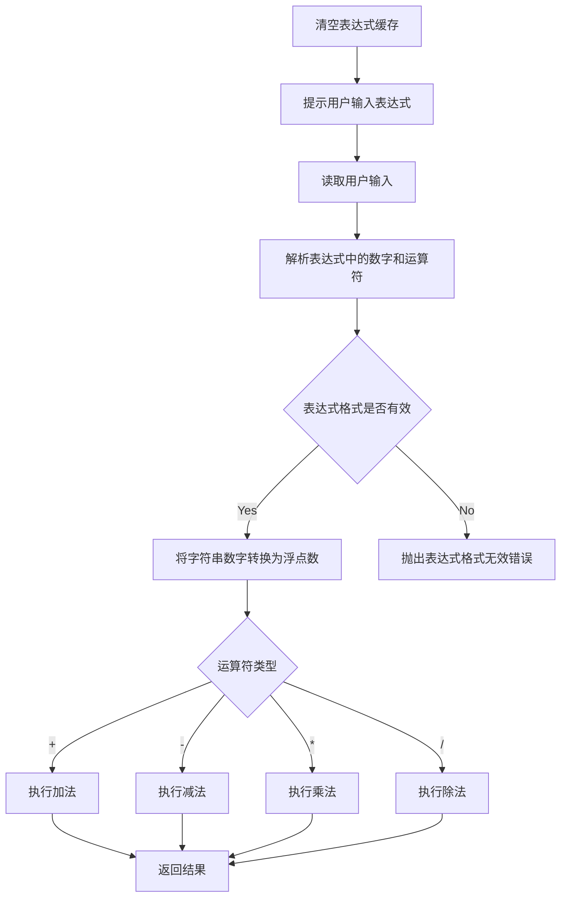
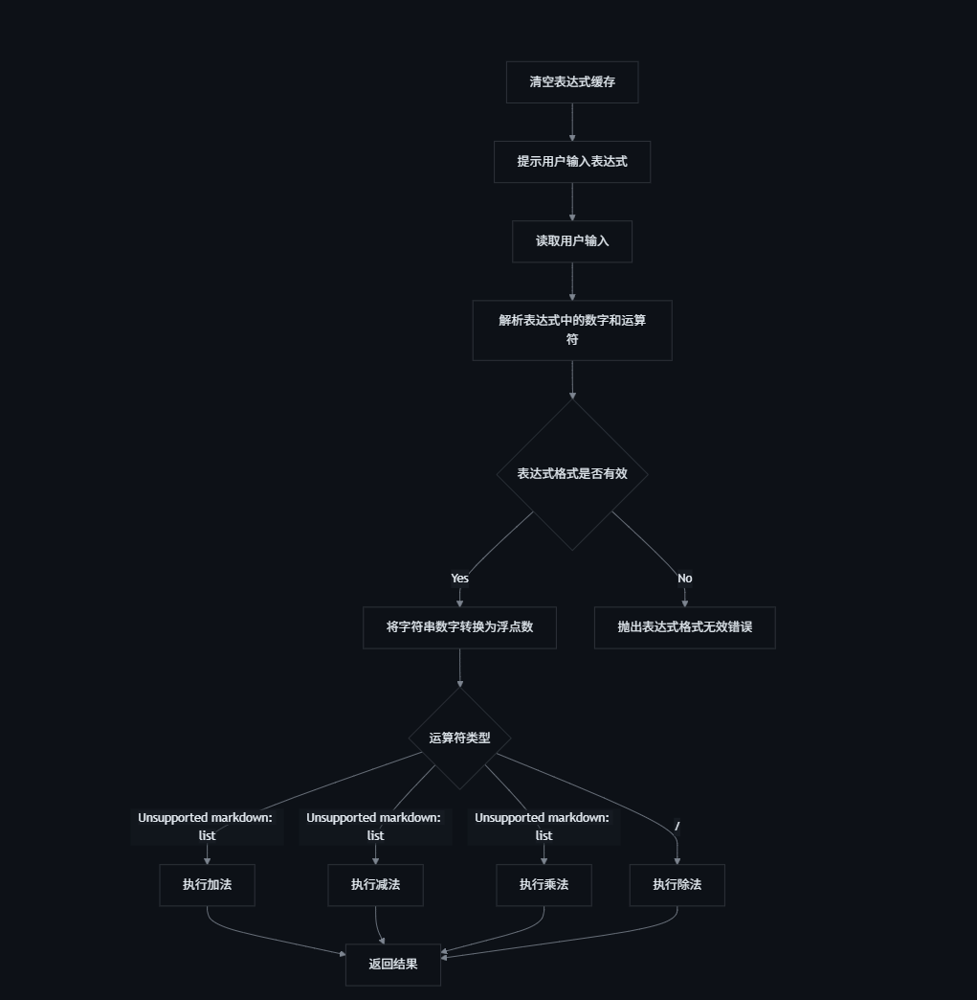

    1. 错误处理改进：
        - 使用 Result 类型替代 panic!
        - 所有错误都返回 Err(String) 而不是直接退出
        - 主循环中使用 match 处理成功和失败的情况
    2. Calculator trait 修改：
        - divide 方法现在返回 Result<f64, String>
        - 其他方法保持不变，但结果被包装在 Ok 中
    3. 错误信息本地化：
        - 所有错误信息改为中文
        - 错误信息更加详细和友好
    4. 输入处理改进：
        - 使用 ? 运算符处理可能的错误
        - 更好的错误传播机制
    5. 现在程序的行为是：
        - 如果输入正确，显示计算结果
        - 如果输入有误（比如除数为零、格式错误等），显示错误信息并继续运行
        - 用户可以继续输入新的表达式，直到手动退出程序
    6. 你可以测试以下情况：
        - 正常计算：1.5 + 2.3
        - 除数为零：1 / 0
        - 格式错误：1.2.3 + 4
        - 无效字符：1 + abc
    - 所有这些情况都会显示相应的错误信息，并允许你继续输入新的表达式。

